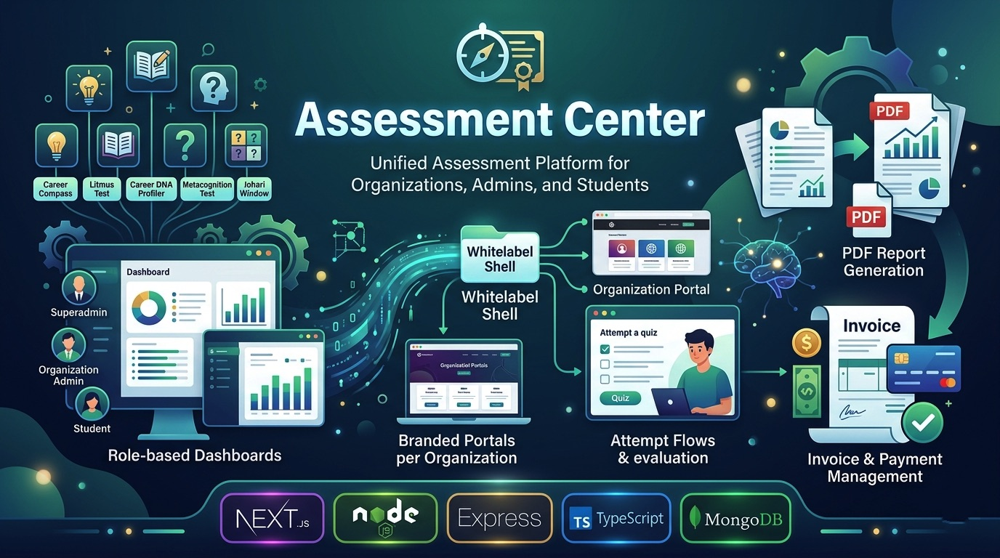

<div align="center">



### Assessment Center

[](https://nextjs.org/)
[](https://nodejs.org/)
[](https://www.typescriptlang.org/)
[](https://www.mongodb.com/)

</div>

---

## 📋 Table of Contents

- [Overview](#-overview)
- [Documentation](#-documentation)
- [Features](#-features)
- [Tech Stack](#-tech-stack)
- [Project Structure](#-project-structure)
- [Getting Started](#-getting-started)
- [Environment Variables](#-environment-variables)
- [API Reference](#-api-reference)
- [Pages & Routes](#-pages--routes)
- [Troubleshooting & Index Notes](#-troubleshooting--index-notes)

---

## 🌟 Overview

Assessment Center is a whitelabel-ready assessment platform that helps organizations deliver assessments, generate reports, manage invoices and payments, and host branded portals per organization. It supports role-based dashboards for superadmins, organization admins, and students.

This repository contains the frontend (Next.js + TypeScript) and backend (Node.js + Express + TypeScript) with Mongoose (MongoDB).

---

## 📚 Documentation

Professional technical documentation is available in the [`docs/`](./docs/) folder:

| Document | Description |
|----------|-------------|
| [Documentation Index](./docs/README.md) | Entry point and reading guide |
| [Technical Documentation](./docs/Assessment_Center_Technical_Documentation.md) | Master SRS/architecture/feature document |
| [Complete Feature Inventory](./docs/03_Complete_Feature_Inventory.md) | Every feature mapped to frontend, backend, DB, and API |
| [Application Code Reference](./docs/06_Application_Code_Reference.md) | All 59 routes, 60+ components, 74 services, 17 models |
| [API Reference](./docs/04_API_Documentation.md) | Complete REST API (70+ endpoints) |
| [Database Design](./docs/05_Database_Documentation.md) | MongoDB schemas and relationships |
| [Deployment Guide](./docs/07_Deployment_Guide.md) | Setup, build, and production deployment |
| [Word (.docx) versions](./docs/docx/) | Pre-generated Word copies of all documentation |

To regenerate `.docx` files: `python3 docs/scripts/convert_md_to_docx.py`

---

## ✨ Features

- Multi-role dashboards (superadmin, organization admin, student)
- Whitelabel slugs and custom theming per organization
- Assessment catalog, student attempt flows, and automated evaluation
- PDF/report generation for different assessment types
- Invoice creation, payment sessions, and coupon management
- OTP-based email login and JWT authentication
- Secure role-scoped access and audit logging

---

## 🛠 Tech Stack

| Layer | Technology |
|-------|------------|
| Frontend | Next.js 16 (App Router), TypeScript, Tailwind CSS |
| Backend | Node.js, Express 5, TypeScript |
| Database | MongoDB (Mongoose) |
| Auth | OTP Email + JWT |

---

## 📁 Project Structure

```
Project-Assessment-Center/
├── backend/
│   ├── src/
│   │   ├── config/
│   │   ├── controllers/
│   │   ├── models/
│   │   ├── routes/
│   │   ├── services/
│   │   └── server.ts
│   ├── package.json
│   └── tsconfig.json
├── frontend/
│   ├── src/
│   │   ├── app/ (Next.js routes)
│   │   ├── components/
│   │   ├── lib/
│   │   └── styles/
│   ├── public/ (images, logos)
│   └── package.json
└── README.md
```

---

## 🚀 Getting Started

### Prerequisites

- Node.js (v18+ recommended)
- npm (or yarn)
- MongoDB (local or Atlas)

### Install & run (development)

```bash
# frontend
cd frontend
npm install
npm run dev

# backend (in separate terminal)
cd backend
npm install
npm run dev
```

Frontend default: `http://localhost:3000`
Backend default: `http://localhost:5000`

### Production build

```bash
# frontend
cd frontend
npm run build

# backend
cd ../backend
npm run build
npm start
```

---

## 🔑 Environment Variables

Create `.env` files in `backend/` and `frontend/` as needed. Example `backend/.env`:

```
PORT=5000
MONGO_URI=mongodb://localhost:27017/assessment-center
JWT_SECRET=your_jwt_secret
MAIL_FROM=hello@yourdomain.com
RAZORPAY_KEY=...
RAZORPAY_SECRET=...
```

Example `frontend/.env.local`:

```
NEXT_PUBLIC_API_URL=http://localhost:5000/api
```

---

## 📡 API Reference (selected)

Auth

| Method | Endpoint | Description |
|--------|----------|-------------|
| POST | `/api/auth/send-otp` | Request OTP to email |
| POST | `/api/auth/verify-otp` | Verify OTP → returns JWT |
| GET | `/api/auth/me` | Get current user (auth required) |

Assessments & Reports

| Method | Endpoint | Description |
|--------|----------|-------------|
| GET | `/api/assessments` | List available assessments |
| POST | `/api/assessments/:id/attempt` | Start/submit attempt |
| GET | `/api/reports/:attemptId` | Fetch generated report |

Invoices & Payments

| Method | Endpoint | Description |
|--------|----------|-------------|
| POST | `/api/invoices` | Create invoice |
| GET | `/api/invoices/:id` | Fetch invoice |
| POST | `/api/payments/verify` | Verify payment session |

---

## 🧭 Pages & Routes

- `/` - Landing page
- `/login` - Login (OTP)
- `/dashboard` - Admin dashboard
- `/whitelabel/[slug]` - Organization portal
- `/privacy-policy`, `/terms-and-conditions`, `/disclaimer`, `/refund-policy` - Legal pages

---

## ⚠️ Troubleshooting - MongoDB index conflict

You might encounter an index conflict like:

```
MongoServerError: An existing index has the same name as the requested index. Requested index: { invoiceNumber: 1 }, existing index: { unique: true, key: { invoiceNumber: 1 }, name: "invoiceNumber_1" }
```

Cause: an index with the same key exists but with different options (e.g., `unique: true`).

Fixes:

1) Non-destructive: Inspect indexes and adapt initializer

```js
db.invoices.getIndexes()
```

2) Destructive: drop conflicting index and restart backend so initializer recreates it

```bash
use your-db
db.invoices.dropIndex('invoiceNumber_1')
# restart backend
```

The repo now includes a safe check in `backend/src/services/indexInitializer.ts` to avoid creating indexes that already exist.

---

## ✅ Next steps / Contribution

- Replace remaining documentation references to the old name if permanent rebranding is desired.
- Add a migration script to reconcile indexes across environments.
- Add more tests and visual QA for the updated landing/footer/legal pages.

---

Maintainers: ADMITra / KAREER Studio
# Assessment Center

This repository contains a full-stack assessment platform (Next.js frontend + Node/Express + TypeScript backend) originally developed as "Assessment Center". It provides organization-facing dashboards, student assessment flows, payments, invoices and whitelabel support.

This README documents repository structure, local setup, build/run commands, recent changes made (legal pages, footer, index initializer fix), and MongoDB index conflict troubleshooting.

---

## Repository layout

- `frontend/` - Next.js app (app-router) using TypeScript and Tailwind CSS. Frontend assets, components and app routes live here.
- `backend/` - Express + TypeScript backend with Mongoose models and index initialization logic.
- Documentation files: `ARCHITECTURE.md`, `IMPLEMENTATION_SUMMARY.md`, `README.md` (this file) etc.

Key frontend files edited recently:
- Footer component: [frontend/src/components/site/Footer.tsx](frontend/src/components/site/Footer.tsx#L1)
- Legal pages: [frontend/src/app/privacy-policy/page.tsx](frontend/src/app/privacy-policy/page.tsx#L1), [frontend/src/app/terms-and-conditions/page.tsx](frontend/src/app/terms-and-conditions/page.tsx#L1), [frontend/src/app/disclaimer/page.tsx](frontend/src/app/disclaimer/page.tsx#L1), [frontend/src/app/refund-policy/page.tsx](frontend/src/app/refund-policy/page.tsx#L1)

Key backend file changed:
- Index initializer: [backend/src/services/indexInitializer.ts](backend/src/services/indexInitializer.ts#L1)

---

## Prerequisites

- Node.js (v18+ recommended)
- npm (or yarn)
- MongoDB instance (local or remote)

---

## Environment variables

Create `.env` files in the `frontend/` and `backend/` folders as required. Basic backend example (`backend/.env`):

```
PORT=5000
MONGO_URI=mongodb://localhost:27017/your-db
JWT_SECRET=change-me
MAIL_FROM=hello@example.com
```

Refer to code comments for additional env keys used by services (Razorpay, SMTP, etc.).

---

## Local development

1. Install dependencies

```bash
# frontend
cd frontend
npm install

# backend
cd ../backend
npm install
```

2. Start services

Frontend (Next.js):

```bash
cd frontend
npm run dev
```

Backend (dev server with auto-reload):

```bash
cd backend
npm run dev
```

3. Production build

```bash
# frontend
cd frontend
npm run build

# backend
cd ../backend
npm run build
npm start
```

---

## Recent changes and rationale

- Legal pages (`/privacy-policy`, `/terms-and-conditions`, `/disclaimer`, `/refund-policy`) were replaced with canonical content provided in the attached `Footer/app` folder and rebranded to "Assessment Center".
- `Footer.tsx` layout changed from a 4-column grid (one empty column was creating a large right-hand gap) to a 3-column layout so the footer content fills the width more gracefully.
- `backend/src/services/indexInitializer.ts` was updated to check existing collection indexes before attempting to create them. This prevents `IndexKeySpecsConflict` errors when an index with the same key/name already exists but with different options (unique/sparse). The initializer now queries existing indexes and creates only missing ones.

---

## MongoDB index conflict (you saw this error)

Error excerpt you might have seen:

```
MongoServerError: An existing index has the same name as the requested index. ... Requested index: { invoiceNumber: 1 }, existing index: { unique: true, key: { invoiceNumber: 1 }, name: "invoiceNumber_1" }
```

Why it happens:
- If an index already exists with the same key but different options (for example `unique: true`), calling `createIndex` again without matching options will cause MongoDB to raise `IndexKeySpecsConflict`.

What the repository change does:
- The updated `ensureInvoiceIndexes` now calls `collection.indexes()` and compares keys before attempting to create an index, avoiding the conflict.

Manual fix options (if you prefer to coerce indexes):

- Option A - Drop the conflicting index and let the initializer recreate it (destructive):

```bash
# connect to mongo shell or use mongosh
use your-db
db.invoices.dropIndex('invoiceNumber_1')
# then restart backend so initializer can recreate the index as intended
```

- Option B - Inspect existing indexes and adjust initializer to match required options (non-destructive):

```js
// Example: list indexes
db.invoices.getIndexes()
```

Use Option A only if you are sure dropping the index is safe for your environment.

---

## Troubleshooting & tips

- If frontend shows old brand strings in docs (README, ARCHITECTURE.md), those files still contain legacy references to "Assessment Center" and can be renamed/replaced on request.
- If the backend dev server fails to start: ensure `backend/.env` exists and `MONGO_URI` is reachable.
- To view runtime logs for index creation, start the backend with the dev command and watch the console for the `✓ Invoice indexes ensured` message.

---

## Next suggested tasks
- Add a migration script to reconcile index differences across environments (create/alter indexes safely).
- Add visual QA screenshots and accessibility checks for the updated footer and legal pages.

---

If you'd like, I can:
- Run the backend dev server now and watch logs to confirm the index initializer no longer throws the conflict.
- Add the cookie policy page content to `frontend/src/app/cookies/page.tsx` to match the other legal pages.

Contact / Maintainers
- Maintainer: ADMITra / KAREER Studio team

License
- See repository root for licensing. If none, contact maintainers for license details.

# Assessment Center

Assessment Center is the new unified whitelabel shell for all assessment products.

Current foundation includes:
- Node.js + TypeScript backend with MongoDB
- Next.js + TypeScript frontend
- OTP + captcha based signup/login
- Default superadmin bootstrap for `maitripatel2608@gmail.com`
- Whitelabel organization model
- Central assessment catalog
- Superadmin pricing and coupon management
- Invoice-ready data model

## Assessment sources linked in Assessment Center

Assessment Center currently registers these assessment sources without modifying their individual apps:
- Career Compass
- Litmus Test
- Career DNA Profiler
- TEST
- CLEAR
- AIM
- Study Abroad Readiness
- Resilience Quotient
- Employability Quotient

The platform seed stores the source project names, seed commands, and reference locations for evaluation/report/invoice parity.

## Environment setup

### Backend
Copy [backend/.env.example](backend/.env.example) to `backend/.env` and update values.

### Frontend
Copy [frontend/.env.local.example](frontend/.env.local.example) to `frontend/.env.local`.

## Run locally

### Backend
Run `npm run seed:platform` once, then `npm run dev` inside `backend`.

### Frontend
Run `npm run dev` inside `frontend`.

## Validation

- Backend: `npm run build`
- Frontend: `npm run lint`
- Frontend: `npm run build`

## Notes

- Default superadmin is created in the database by bootstrap logic, not through `.env`.
- Existing sibling assessment applications are treated as source references and remain untouched.
- The current Assessment Center delivery establishes the unified auth, catalog, whitelabel, coupon, pricing, and dashboard foundation. 
